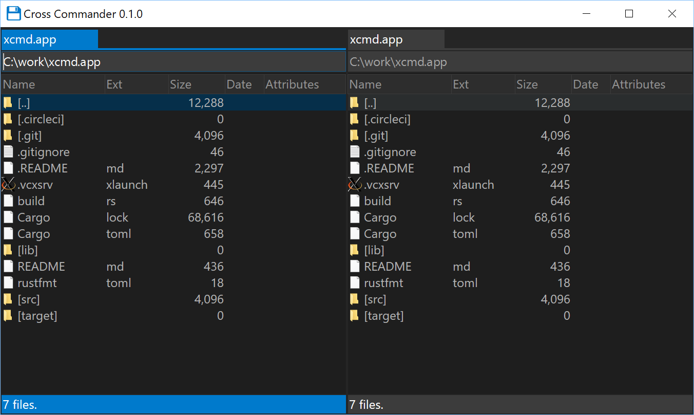

# Cross Commander (xcmd)

Cross Commander is classic dual-pane file manager that allows you to work with files efficiently.

For design documents, see [wiki](https://github.com/xcmd-io/xcmd/wiki).

## Building

~~~
cargo build --release
~~~

To build in WSL, install `pkg-config`, `libssl-dev`, `libgtk-3-dev` packages first.

~~~
sudo apt install pkg-config libssl-dev libgtk-3-dev
~~~
